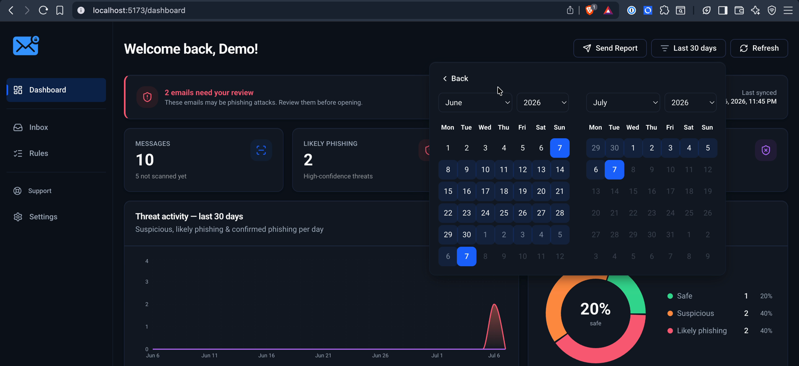
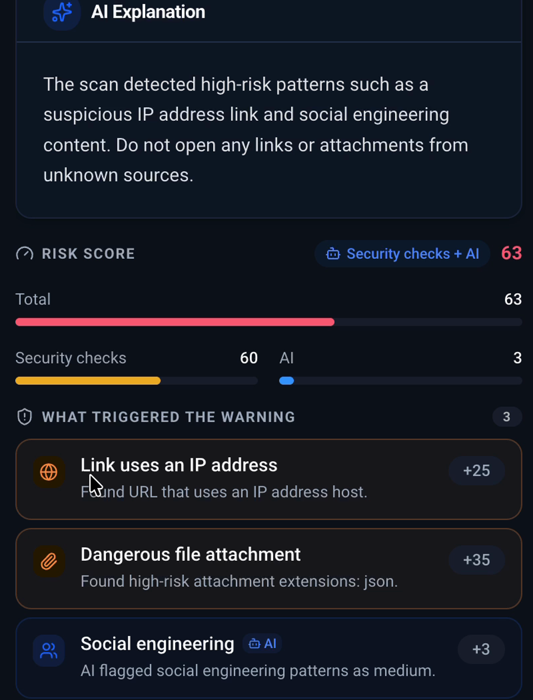
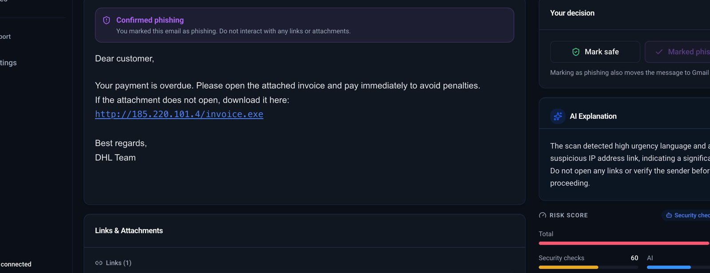

# SecureInbox

[](https://github.com/AndreiStolojan/SecureInbox/actions/workflows/quality.yml)
[](LICENSE)

**Explainable phishing triage for Gmail.** SecureInbox is a security-focused
inbox that synchronizes Gmail messages, scores suspicious signals, and shows
the evidence behind each verdict before a user takes action.

Developed as a bachelor thesis project, it is deliberately not a Gmail
replacement. The focus is a transparent detection workflow: deterministic
rules first, optional local AI as a secondary source of semantic signals, and
manual review actions for the final decision.

<p align="center">
  
</p>

<p align="center">
  
  
</p>

## Why it is explainable

- **Deterministic rules decide first.** The scanner records every triggered
  rule, its points, and a controlled explanation.
- **Scores are auditable.** The interface separates `ruleScore` from
  `aiScore`, then presents the final 0-100 score and evidence.
- **AI is optional and bounded.** Local Ollama signals are capped at 50 points;
  the `likely_phishing` threshold is 60, so AI cannot produce that verdict on
  its own.
- **Context is controlled.** Verified-brand logic and user-managed trusted or
  blocked sender lists reduce false positives without suppressing critical
  payload signals.

## Features

- Gmail OAuth 2.0 connection, manual sync, and scheduled polling.
- Parsing for sender, reply-to address, links, domains, attachments, and dates.
- Rule-based phishing analysis for URL, attachment, and header signals.
- Optional local semantic analysis through Ollama.
- Sanitized email HTML with remote images blocked by default.
- Inbox triage, score explanations, trusted/blocked sender lists, and manual
  safe/phishing decisions.
- Monthly security summary, email notifications, and account deletion.

## Architecture

```text
React + Vite -> Express API -> MongoDB
                    |
                    +-> Gmail API / OAuth 2.0
                    +-> Optional local Ollama
```

The application is a modular monolith. The React frontend renders server-side
scan results; the Express backend owns authentication, Gmail integration,
scoring, reporting, and persistence.

Read more about the [architecture](docs/architecture.md) and the
[explainable detection engine](docs/detection-engine.md).

## Tech stack

| Area | Technologies |
| --- | --- |
| Frontend | React 19, Vite, Tailwind CSS, shadcn/ui, Radix, Recharts |
| Backend | Node.js, Express, MongoDB, Mongoose |
| Security | JWT, bcrypt, Joi, Helmet, CORS, Arcjet |
| Integrations | Gmail API, OAuth 2.0, node-cron, Nodemailer, Ollama |
| Testing | Node test runner, Vitest, Testing Library |

## Run locally

### Prerequisites

- Node.js 24.5.0 or newer (LTS)
- MongoDB instance
- Google Cloud OAuth client with the Gmail API enabled
- Ollama is optional; the application works with semantic analysis disabled

### Configuration

```bash
cp backend/.env.example backend/.env.development.local
cp frontend/.env.example frontend/.env.local
npm --prefix backend install
npm --prefix frontend install
```

Set the MongoDB, JWT, encryption-key, and Google OAuth values in
`backend/.env.development.local`. For local Gmail OAuth, configure this exact
redirect URI in Google Cloud:

```text
http://localhost:5500/api/v1/mail-accounts/google/callback
```

### Start the application

```bash
npm --prefix backend run dev
npm --prefix frontend run dev
```

- Frontend: `http://localhost:5173`
- API: `http://localhost:5500/api/v1`

## Verify quality

```bash
npm --prefix backend run lint
npm --prefix backend test
npm --prefix frontend test
npm --prefix frontend run build
```

The same checks run through GitHub Actions for every pull request and push to
`main`.

## Deploy on Raspberry Pi

The production Compose stack is designed for a 64-bit Raspberry Pi host:

```text
Cloudflare Tunnel -> nginx / React -> Express -> MongoDB Atlas
```

No application port is published on the host and Ollama is disabled by
default for the Raspberry Pi deployment. Follow the complete
[Raspberry Pi deployment guide](docs/raspberry-pi-deployment.md) for hardware,
Cloudflare, Google OAuth, secrets, startup, verification, updates, and backup.

## Limitations

- SecureInbox is a local/demo project; it is not publicly deployed and Google
  OAuth verification for a public production deployment has not been pursued.
- It does not train a machine-learning model and does not claim precision,
  recall, or F1 metrics without a labeled dataset.
- SPF, DKIM, and DMARC verification are future work.
- Gmail synchronization uses polling rather than Gmail Push Notifications.

## Author

Andrei Stolojan<br>
[GitHub](https://github.com/AndreiStolojan) · [LinkedIn](https://www.linkedin.com/in/andrei-stolojan/)

## License

Released under the [MIT License](LICENSE).
